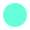

 

  <h3 align="center"><a href="https://juliagrandury.github.io/">Welcome to my Portfolio👋</a></h3>
  

    Feel free to click around and learn more about me!
     
     
    <a href="https://github.com/JuliaGrandury/juliagrandury.github.io/issues">Report Bug</a>
    ·
    <a href="https://github.com/JuliaGrandury/juliagrandury.github.io/issues">Request Feature</a>
  

## Font Pairings
- <a href="https://www.typewolf.com/raisonne">Raisonné</a>
- <a href="https://fonts.google.com/specimen/Roboto+Mono">Roboto Mono</a>

## Color Palette 🎨

| Color          | Hex                                                                |
| -------------- | ------------------------------------------------------------------ |
| Turquoise      |  `#64ffda` |
| Light Navy     |  `#233554` |
| Navy           |  `#112240` |
| Dark Navy      |  `#0a192f` |
| Light Gray     |  `#ccd6f6` |
| Gray           |  `#a8b2d1` |
| Dark Gray      |  `#8892b0` |
| White          |  `#e6f1ff` |

